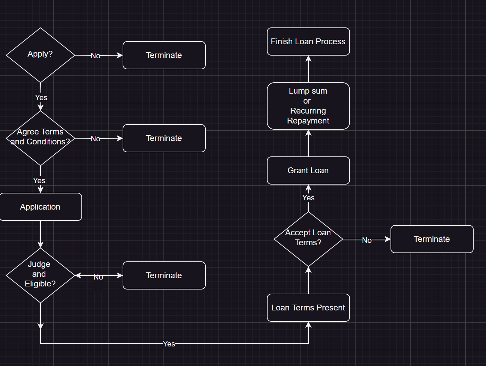
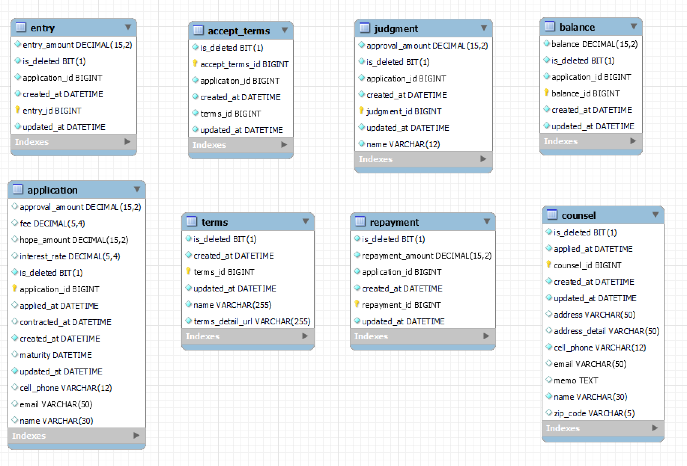

# Loan Service

This Service is implemented based on a very simple "loan process" scenario, with minimum functionalities in each loan process. 

## Scenario

## Entity Diagram

## Features
- Added a few simple entities to meet the scenario described above
- User can add necessary document to store file in a local file system (i.e. Terms and Conditions)
- User can repay granted loan amount (lump sum, or recurring payment) and check the balance

## Tech Stack

- Spring
- Gradle
- Spring Data JPA
- MySql
